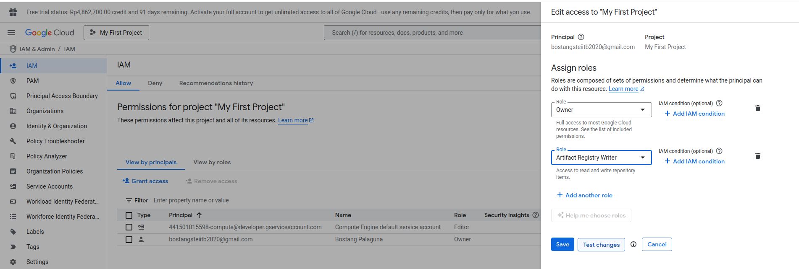
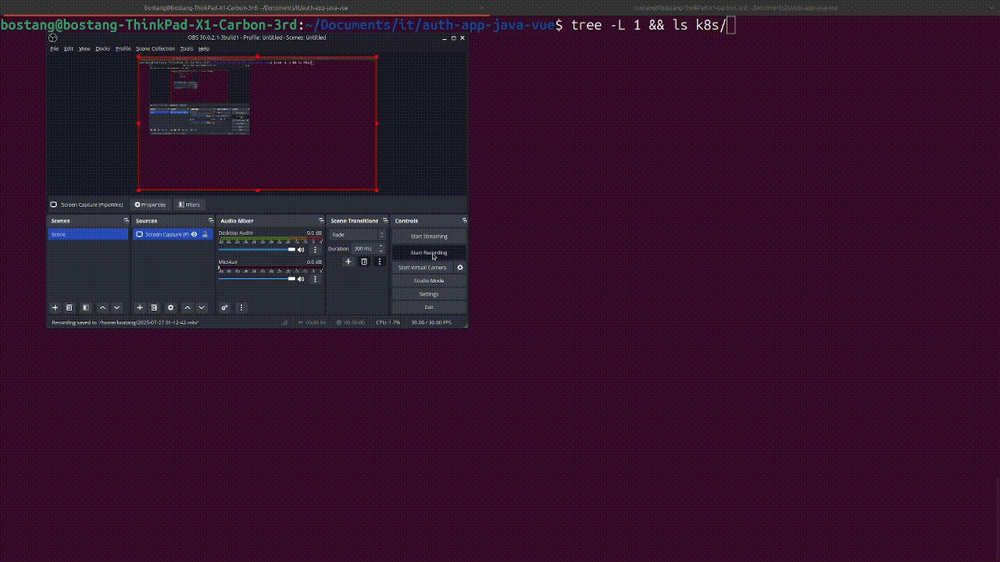

# auth-app-java-vue

## Google Kubernees Engine (GKE)

```bash
### Cara push ke GCR

```bash
# build docker image
docker build -t asia.gcr.io/primeval-rune-467212-t9/auth-vue-frontend ./frontend
docker build -t asia.gcr.io/primeval-rune-467212-t9/auth-java-backend ./backend

# login ke gcloud
# gcloud auth login

# autentikasi docker
# gcloud auth configure-docker

docker push asia.gcr.io/primeval-rune-467212-t9/auth-vue-frontend:latest
docker push asia.gcr.io/primeval-rune-467212-t9/auth-java-backend:latest

gcloud auth list

gcloud config get-value project

# aktifkan API artifact registry
gcloud services enable artifactregistry.googleapis.com

# CATATAN : APABILA PUSH GAGAL, LAKUKAN MELALUI CLOUD SHELL TERMINAL DI GOOGLE CLOUD
```

## Terraform Script to create cluster

```bash
terraform init
terraform plan -out tfplan
terraform apply -auto-approve tfplan
```

## Deploy Pods to cluster

```bash
gcloud container clusters get-credentials auth-vue-java-cluster --region asia-southeast1-a --project primeval-rune-467212-t9

gcloud artifacts repositories create auth-app-repo \
    --repository-format=docker \
    --location=asia-southeast1 \
    --description="Docker repository for Auth App" \
    --project=primeval-rune-467212-t9

gcloud auth configure-docker asia-southeast1-docker.pkg.dev

# Di root proyek Anda (auth-app-java-vue)
cd backend
./mvnw clean package -DskipTests
cd ..
docker build -t asia-southeast1-docker.pkg.dev/primeval-rune-467212-t9/auth-app-repo/auth-backend:latest ./backend
docker push asia-southeast1-docker.pkg.dev/primeval-rune-467212-t9/auth-app-repo/auth-backend:latest

docker build -t asia-southeast1-docker.pkg.dev/primeval-rune-467212-t9/auth-app-repo/auth-frontend:latest ./frontend
docker push asia-southeast1-docker.pkg.dev/primeval-rune-467212-t9/auth-app-repo/auth-frontend:latest


# Pastikan Anda berada di root proyek (auth-app-java-vue)
kubectl create configmap frontend-nginx-config --from-file=frontend/nginx.conf
```

<!-- ```bash
# Install gcloud-cli (linux)
# https://cloud.google.com/sdk/docs/install-sdk
curl -O https://dl.google.com/dl/cloudsdk/channels/rapid/downloads/google-cloud-cli-linux-x86_64.tar.gz
tar -xf google-cloud-cli-linux-x86_64.tar.gz
./google-cloud-sdk/install.sh
./google-cloud-sdk/bin/gcloud init
# install komponen : kubectl
gcloud components install kubectl

# login & konfigurasi gcloud
gcloud auth login
# gcloud config set project <YOUR_PROJECT_ID>
gcloud config set project primeval-rune-467212-t9

# atau akses via online terminal : https://shell.cloud.google.com/

# buat cluster baru
# LAKUKAN DARI GOOGLE CLOUD CONSOLE (GUI)
gcloud beta container clusters create "vue-java-auth-app" \
  --project "primeval-rune-467212-t9" \
  --region "asia-southeast1" \
  --tier "standard" \
  --no-enable-basic-auth \
  --cluster-version "1.33.2-gke.1111000" \
  --release-channel "regular" \
  --machine-type "e2-micro" \
  --image-type "COS_CONTAINERD" \
  --disk-type "pd-standard" \
  --disk-size "15" \
  --metadata disable-legacy-endpoints=true \
  --num-nodes "2" \
  --logging=SYSTEM,WORKLOAD \
  --monitoring=SYSTEM,STORAGE,POD,DEPLOYMENT,STATEFULSET,DAEMONSET,HPA,JOBSET,CADVISOR,KUBELET,DCGM \
  --enable-ip-alias \
  --network "projects/primeval-rune-467212-t9/global/networks/default" \
  --subnetwork "projects/primeval-rune-467212-t9/regions/asia-southeast1/subnetworks/default" \
  --no-enable-intra-node-visibility \
  --default-max-pods-per-node "110" \
  --enable-ip-access \
  --security-posture=standard \
  --workload-vulnerability-scanning=disabled \
  --no-enable-google-cloud-access \
  --addons HorizontalPodAutoscaling,HttpLoadBalancing,GcePersistentDiskCsiDriver \
  --enable-autoupgrade \
  --enable-autorepair \
  --max-surge-upgrade 1 \
  --max-unavailable-upgrade 0 \
  --binauthz-evaluation-mode=DISABLED \
  --enable-managed-prometheus \
  --enable-shielded-nodes \
  --shielded-integrity-monitoring \
  --no-shielded-secure-boot

# dapatkan kredential cluster u/ k8s
gcloud container clusters get-credentials vue-java-auth-app --zone=asia-southeast1

# Login ke GCR terlebih dahulu
gcloud auth configure-docker

# Bangun image
# syntax:
# docker build -t gcr.io/<YOUR_PROJECT_ID>/<NAMA_IMAGE>:<TAG>   <DIREKTORI_BUILD>

# Bangun image frontend
docker build -t asia.gcr.io/primeval-rune-467212-t9/auth-app-java-vue-frontend:latest --build-arg VUE_APP_API_BASE_URL=/api ./frontend

# Push image frontend ke GCR
docker push asia.gcr.io/primeval-rune-467212-t9/auth-app-java-vue-frontend:latest

# (Jika ada Dockerfile backend di root project, atau sesuaikan path-nya)
docker build -t asia.gcr.io/primeval-rune-467212-t9/auth-app-java-vue-backend:latest ./backend # Sesuaikan path ke Dockerfile backend Anda

# Push image backend ke GCR
docker push asia.gcr.io/primeval-rune-467212-t9/auth-app-java-vue-backend:latest

# Terapkan semua file manifest ke cluster GKE Anda
kubectl apply -f k8s/

# Dapatkan Alamat IP Ingress Eksternal
kubectl get ingress auth-app-ingress

# memperbarui APP_FRONTEND_URL di secret backend agar CORS berfungsi dengan benar.
kubectl edit secret backend-secrets

# Restart Deployment Backend agar perubahan pada secret diambil oleh pod backend
kubectl rollout restart deployment backend-deployment
```
 -->

Catatan : untuk bisa docker push ke `gcr.io`, tambahkan di bagian IAM role sebagai **Artifact Registry Writer** .



<!-- ## Demonstrasi



## Cara Menjalankan (Minikube k8s)

```bash
# memulai service minikube
minikube start

# lakukan dari root folder
# memulai pods
minikube kubectl -- apply -f k8s/

# lihat url frontend (u/ akses dari browser)
minikube service frontend-service
```

## PENTING DIBACA SUPAYA BISA KOMUNIKASI ANTAR PODS

Kuncinya ada 2 :

1. Backend mengizinkan akses frontend (CORS)
2. Frontend hit endpoint API yang benar

### Cara mencapai **Kunci 1**

**Langkah 0** : dapatkan IP dari minikube

```bash
minikube ip
```

**Langkah 1** : Atur IP frontend-service agar sama dengan IP minikube + set port statis (NodePort)

caranya? gunakan `type:NodePort` dan atur nilai `nodePort` pada `frontend-service.yml`

```yml
apiVersion: v1
kind: Service
metadata:
  name: frontend-service
spec:
  type: NodePort
  selector:
    app: frontend
  ports:
    - protocol: TCP
      port: 80 # Port service Kubernetes
      targetPort: 80 # Port container Nginx
      nodePort: 30080 # Port untuk akses dari browser
```

**Langkah 2** : Atur CORS origin policy di sisi backend

pada `backend-deployment.yml` simpan:

```yml
env:
- name: APP_FRONTEND_URL
    valueFrom:
    secretKeyRef:
        name: backend-secrets
        key: APP_FRONTEND_URL # Ambil URL frontend dari Secret
```

`backend-secret.yml`

```yml
stringData:
  APP_FRONTEND_URL: "http://192.168.49.2:30080" 
  # 192.168.49.2 : IP dari minikube (jalankan command `minikube ip` di terminal)
  # 30080: NodePort (diatur statis di frontend-service.yml)
```

info : `APP_FRONTEND_URL` akan di-set: `app.frontend.url=${APP_FRONTEND_URL}` pada `application.properties` untuk kemudian dipanggil ke `SecurityConfig.java` :

```java
@Value("${app.frontend.url}")
    private String frontendUrl;
    
    @Bean
    public CorsFilter corsFilter() {
        // ...
        config.addAllowedOrigin(frontendUrl); // Your Vue.js dev server
        // ...
    }
```

### Cara mencapai **Kunci 2**

**Langkah 1** : Pastikan endpoint yang akan di-hit dari frontend sesuai dengan controller di backend.

- login

```js
// ingat bahwa : IP minikube : http://192.168.49.2
// maka akan hit ke : http://192.168.49.2/api/auth/login
const response = await axios.post(`${process.env.VUE_APP_API_BASE_URL}/api/auth/login`, {
    username: this.username,
    password: this.password
});
```

- register

```js
// hit ke http://192.168.49.2/api/auth/register
const response = await axios.post(`${process.env.VUE_APP_API_BASE_URL}/api/auth/register`, {
    username: this.username,
    password: this.password
});
```

- dashboard

```js
// hit ke http://192.168.49.2/api/dashboard
const response = await axios.get(`${process.env.VUE_APP_API_BASE_URL}/api/dashboard`, {
    headers: {
    Authorization: `Bearer ${token}` // Send the JWT token in the header
    }
});
```

- controller backend

```java
@RequestMapping("/api/auth")
public class AuthController {
    // ...
    @PostMapping("/register")
    // ...
    @PostMapping("/login")
    // ...
}

@RequestMapping("/api/dashboard")
public class DashboardController {
    // ...
}
```

info : menerapkan `VUE_APP_API_BASE_URL` di `env` pada `backend-deployment.yaml` akan SIA-SIA karena nilainya tidak akan terpanggil di kode `javascript`.

```yaml
env: # Variabel lingkungan build-time sekarang adalah variabel runtime yang di-inject di deployment
    - name: VUE_APP_API_BASE_URL # Atau nama variabel lingkungan yang digunakan frontend Anda
    value: "http://backend-service:8081" # URL internal ke backend service
```

**Langkah 2** : atur ingress controller di `ingress.yaml` sehingga request dari localhost dengan endpoint `/` akan diteruskan ke frontend-service, sedangkan endpoint `/api` akan diteruskan ke `backend-service`

```yaml
- host: localhost # Ganti dengan domain Anda jika ada
      http:
        paths:
        # Semua request yang cocok dengan /api akan diteruskan ke backend-service
        - path: /api
          pathType: Prefix
          backend:
            service:
              name: backend-service # Nama Service Kubernetes untuk backend Anda
              port:
                number: 8081 # Port yang diekspos oleh Service backend (sesuai server.port di Spring Boot)

        # Semua request yang tidak cocok dengan /api akan diteruskan ke frontend-service
        - path: /
          pathType: Prefix # Akan cocok dengan semua path
          backend:
            service:
              name: frontend-service # Nama Service Kubernetes untuk frontend Anda
              port:
                number: 80 # Port yang diekspos oleh Service frontend (Nginx di kontainer frontend)
```

## Catatan singkat (minikube k8s)

```bash
# melihat info pods
minikube kubectl -- get pods -w

# berhentikan pods
minikube kubectl -- delete -f k8s/

# lihat log dari pods
minikube kubectl -- logs [nama-pods]

# eksekusi ke dalam pods
minikube kubectl -- exec -it [nama-pods] -- [command]

# contoh:
# minikube kubectl -- get pods
# OUTPUT:
    # NAME                                   READY   STATUS              RESTARTS   AGE
    # backend-deployment-6f6ffccff7-bfr5j    1/1     Running             0          109s
    # db-deployment-c6997d66f-pr9lp          1/1     Running             0          109s
    # frontend-deployment-5696f8968f-n6pp4   0/1     ContainerCreating   0          109s
# minikube kubectl -- exec -it db-deployment-c6997d66f-pr9lp -- psql -U auth_user -d auth_db
# OUTPUT:
    # psql (17.5 (Debian 17.5-1.pgdg120+1))
    # Type "help" for help.

    # auth_db=#

# cek IP minikube
minikube ip

# akses dashboard
minikube dashboard
```

## Catatan Singkat build ulang docker image & push ulang ke Dockerhub (registry)

```bash
# masuk ke folder /frontend/
docker build -t bostang/auth-app-java-vue-frontend:latest .
docker push bostang/auth-app-java-vue-frontend:latest
``` -->
